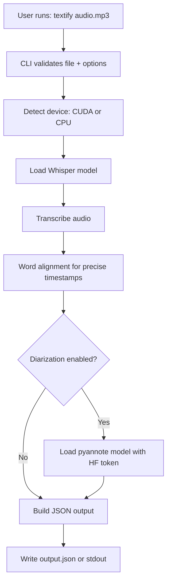

# Textify Flow Chart

## Simple Explanation

1. You run one command with an audio file.
2. Textify validates input and loads models on CPU/GPU.
3. WhisperX transcribes speech to text.
4. Alignment adds word-level timestamps.
5. Optional diarization adds speaker labels.
6. Final structured JSON is written to file/stdout.
